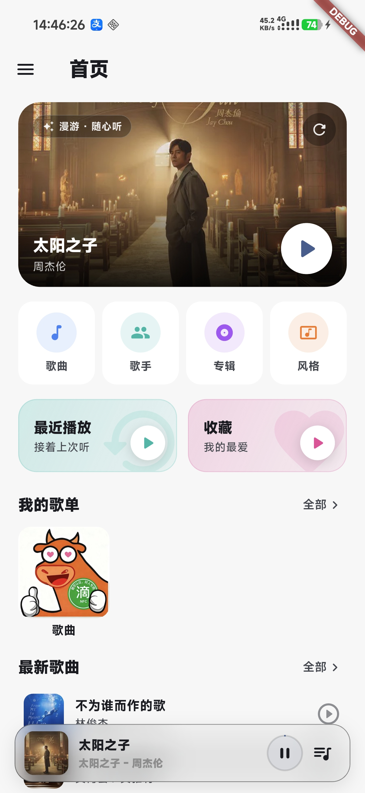
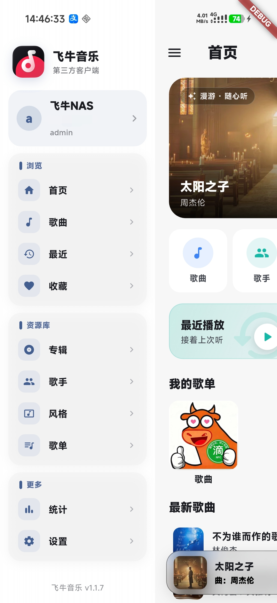
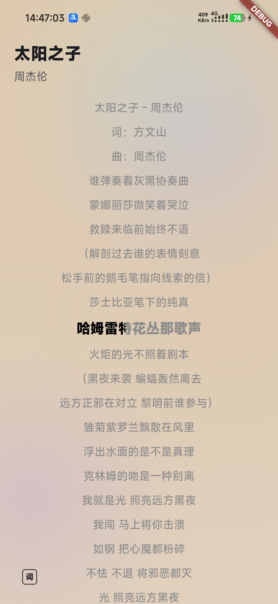

# FeiNiuMusic

飞牛私有云（FNOS）平台的第三方音乐客户端。通过飞牛 NAS 自带的音乐服务 API获取音乐库、播放流和歌词数据，提供完整的在线音乐播放体验。

基于 [NagoMusic](https://github.com/Keduoli03/NagoMusic) 项目深度魔改适配。

## 功能

- **飞牛 NAS 音乐服务对接** — 通过 FNOS 音乐 API 登录、获取歌曲 / 专辑 / 歌手 / 歌单 / 风格
- **FN Connect 连接** — 支持 FNID 自动探测连接，内网/公网 IPv4/IPv6/中继多层链路探测
- **在线播放** — 从 NAS 直接获取音频流，支持随机漫游播放
- **歌词展示** — LRC 歌词（含翻译行解析）与歌曲联动
- **搜索** — 全局搜索歌曲、专辑、歌手
- **收藏与管理** — 收藏歌曲、创建/编辑歌单
- **播放器** — 全屏播放器与歌词页切换，底部控制栏，迷你播放器
- **状态栏歌词** — 支持魅族 / Lyricon 可选方案
- **主题与外观** — 动态渐变背景、主题模式切换、平板模式适配
- **播放历史** — 记录与浏览播放历史

## 与上游 NagoMusic 的差异

- 从通用 WebDAV/本地播放器改造为飞牛 NAS 专属音乐客户端
- 对接 FNOS 音乐服务 API，使用 Cookie 认证
- 净化和精简上游冗余代码，适配飞牛场景

## 适用平台

- Android

## 界面预览

<table>
  <tr>
    <th>首页</th>
    <th>侧边栏</th>
  </tr>
  <tr>
    <td></td>
    <td></td>
  </tr>
  <tr>
    <th>播放器</th>
    <th>歌词</th>
  </tr>
  <tr>
    <td></td>
    <td></td>
  </tr>
</table>

## 从源码构建

### 前置条件

- Flutter SDK（见 `pubspec.yaml` 中 `environment.sdk` 版本要求）
- Android SDK（API 34+）
- JDK 17+

### 获取依赖

```bash
flutter pub get
```

### 调试运行

连接 Android 设备或启动模拟器后，执行以下命令即可在设备上以调试模式启动应用：

```bash
flutter run
```

如需指定目标设备，先通过 `flutter devices` 查看已连接的设备，然后使用 `-d` 参数：

```bash
flutter devices          # 查看设备列表
flutter run -d 设备ID    # 在指定设备上运行
```

### 构建发布版 APK

```bash
# 1. 配置签名（发布版必需）
#    参考 android/key.properties.example 创建 android/key.properties
#    并将 release.keystore 放到 android/app/ 目录下

# 2. 构建 APK（按 CPU 架构拆分）
flutter build apk --release --split-per-abi
```

构建产物位于 `build/app/outputs/flutter-apk/`，按 CPU 架构（arm64-v8a / armeabi-v7a / x86_64）拆分。

## 开源协议

本项目基于上游 [NagoMusic](https://github.com/Keduoli03/NagoMusic) 项目的开源协议发布。
